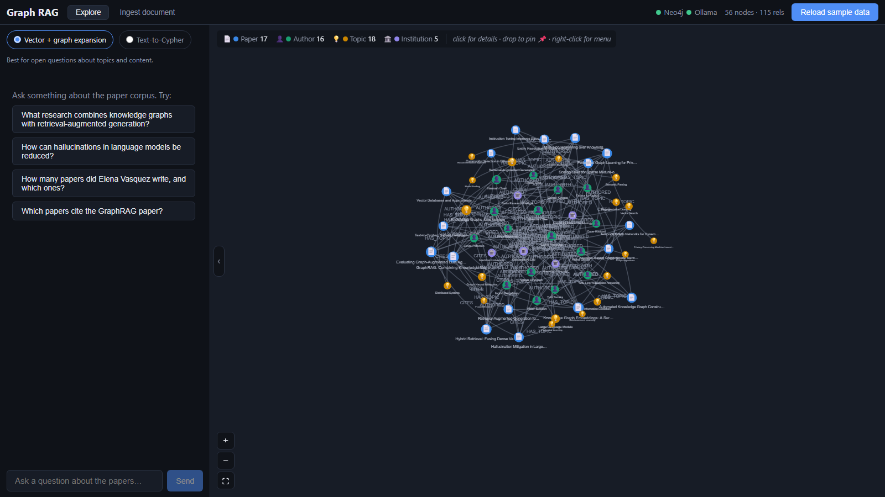

# Graph RAG — Research Papers

A Graph RAG demo application: **Neo4j** (graph + vector index) · **FastAPI** middleware · **React/Vite** frontend · **Ollama** for fully-local LLM inference.



It ships with a fictional dataset of 16 interlinked research papers (authors, institutions, topics, citations) and supports three retrieval modes:

| Mode | How it works | Good for |
|---|---|---|
| **Vector + graph expansion** | Embeds the question, finds similar papers via Neo4j's vector index, then traverses authors/topics/citations around the hits to build context | Open questions about content and topics |
| **Text-to-Cypher** | The LLM writes a Cypher query from your question (with one auto-repair retry), runs it read-only, then phrases the results | Counts, lists, precise relational questions |
| **Document ingestion** | Paste raw text; the LLM extracts title/authors/topics/citations and merges them into the graph, embedded and queryable | Growing the graph from unstructured text |

## Prerequisites

- Docker Desktop
- An **Ollama container already running** and publishing port `11434` on the host, with these models pulled:

```bash
docker exec -it <your-ollama-container> ollama pull gemma2:9b
docker exec -it <your-ollama-container> ollama pull nomic-embed-text
```

## Run it

```bash
cp .env.example .env    # adjust OLLAMA_BASE_URL if needed
docker compose up --build
```

Then:

1. Open **http://localhost:5173**
2. The header shows Neo4j/Ollama connectivity; fix any warning banners first
3. Click **Load sample data** (embeds 16 papers via Ollama — takes ~30s)
4. Ask questions in the **Ask** tab, try both modes, and inspect the retrieved context / generated Cypher under each answer
5. Try the **Ingest document** tab (there's a built-in example) and watch the graph grow in **Graph view**

Neo4j Browser is available at http://localhost:7474 (user `neo4j`, password `graphrag123`) for poking at the graph directly.

## Reaching your Ollama container

The backend defaults to `http://host.docker.internal:11434`, which works when your Ollama container publishes `11434` to the host. If instead it lives on a named Docker network, set in `.env`:

```
OLLAMA_BASE_URL=http://<ollama-container-name>:11434
```

and add that network to the `backend` service in `docker-compose.yml`:

```yaml
  backend:
    networks: [default, your-ollama-network]
networks:
  your-ollama-network:
    external: true
```

## Architecture

```
frontend (React/Vite :5173)
   │  /api proxy
   ▼
backend (FastAPI :8000)
   │  bolt://           │  HTTP
   ▼                    ▼
neo4j :7687          Ollama :11434 (external container)
  graph + vector       gemma2:9b (generation)
  index                nomic-embed-text (embeddings)
```

### Graph schema

```
(:Author {name})-[:AUTHORED]->(:Paper {id, title, abstract, year, embedding})
(:Author)-[:AFFILIATED_WITH]->(:Institution {name})
(:Paper)-[:HAS_TOPIC]->(:Topic {name})
(:Paper)-[:CITES]->(:Paper)
```

The vector index `paper_embeddings` (cosine, dimensions auto-detected from the embedding model) lives on `Paper.embedding`.

### API

| Endpoint | Purpose |
|---|---|
| `GET /api/health` | Neo4j + Ollama connectivity and model availability |
| `POST /api/seed` | Load the sample dataset and build the vector index |
| `POST /api/ask` | `{question, mode: "vector_graph" \| "text2cypher"}` |
| `POST /api/ingest` | `{text}` → entity extraction → graph merge |
| `GET /api/graph` | Nodes + relationships for visualization |
| `GET /api/stats` | Node/relationship counts |

## Notes

- All papers, authors, and institutions in the sample data are fictional.
- Generated Cypher is checked against a write-operation blocklist before execution.
- Both backend (`uvicorn --reload`) and frontend (Vite) hot-reload from the mounted source directories, so you can edit code without rebuilding images.
